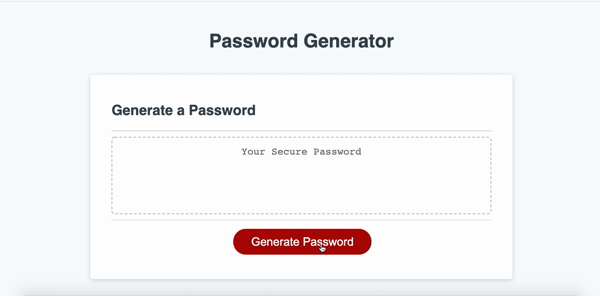

<h1 align="center">
  

</h1>

  I am Christopher Maxwell. I lived in South Africa for my first 30 years. I have skills
  in designing secure network infrastructure as a systems engineer at Cisco. I have built open source software for the courts in The Hague.
  
  I currently work as an engineer for a research based startup solving one of the largest problems we face in the digital world, misinformation. You can see more about Factiverse AS [here](https://www.factiverse.no)

  I hold a BSc Mathematics and Physics (RU) and BSc(HONS) in Quantum Information Science (UKZN).

  <a href="mailto:chris@factiverse.no">
     
  <a/>&nbsp;
  <a href="https://www.linkedin.com/in/christopher-maxwell-aa377196/">
     
  <a/>&nbsp;
  <a href="https://twitter.com/withchristopher">
     
  <a/>&nbsp;
  <a href="https://withchristopher.github.io/">
     
  <a/>

<h1><h1/>

 &nbsp;<i><b>Git Working</b></i>

 

&nbsp;

     

Portfolio

 
                      

                      

                      

                       
                     
                       

                      

                      
                       
                    

<h4 align="center">
Credit: [withchristopher](https://github.com/withchristopher)

Last Edited on: 01/05/2022.
  
</h4>